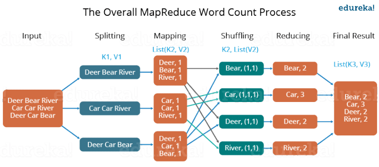
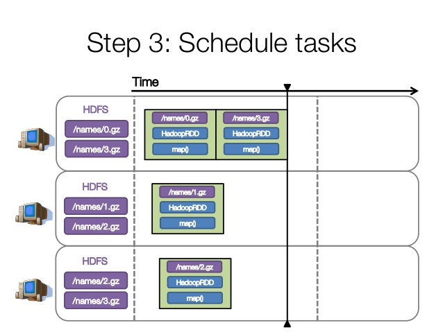
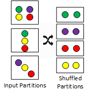

# Memoir on Mapreduce & Spark

Data ! LOTS and LOTS of DATA !!!

It was quite impossible to handle so much data with one hand so we just ended up using multiple, which worked but how many hands ? hands are finite but data is not

Distributing computing was all the rage and with compute getting cheaper engineers were spinning up new servers like covid cases. But with more computers more complexity arrived, there were common issues that almost everyone working with distributed systems had to solve   

- Sending data to/from computers
- Synchronization/ Coordination across computers
- Recovery from failure (Fault Tolerance)

Programmers had to handle all these when writing distributed code which was a pain until the dawn of a new programming model for easily running distributed workloads

Enter **Mapreduce**

MapReduce is just a framework that enables engineers to write distributed applications without having to worry about the underlying distributed computing infrastructure which meant one could transparently scale out the cluster by adding nodes and enable automatic failover of both data storage and data processing subsystems with zero impact on the underlying application.

It's a very simple idea really, You essentially just split your data, process them in chunks and then in the end you combine the results obtained from these chunks. In the process, you end up with the parallelization of your workload. This happens in three steps

1. **Map:** extract information on each split i.e each worker node applies the `map` function to the local data and writes the output to temporary storage. A master node ensures that only one copy of the redundant input data is processed.
2. **Shuffle:** Bring the partitions to the same reducer i.e worker nodes redistribute data based on the output keys (produced by the `map` function), such that all data belonging to one key is located on the same worker node.
3. **Reduce:** aggregate, summarize, filter or transform i.e worker nodes now process each group of output data, per key, in parallel.

This makes it really easy to write distributed batch workflows, Map → Reduce → Repeat

The two-stage paradigm which makes MapReduce easy to abstract is also its pitfall, especially since the amount of data written by the Map function can have a large impact on performance and scalability. A lot of MapReduce implementations are designed to write all communication to distributed storage for crash recovery and this makes repeated access to the same data a really IO heavy operation. So it's hard to have streaming applications run over MapReduce and even when we have an iterative batch program that needs to access the same data again and again with low-latency, MapReduce becomes kinda inefficient

The suboptimal nature of Traditional MapReduce applications arise from the fact that they are based on an acyclic data flow: an application has to run as a series of distinct jobs, each of which reads data from stable storage (e.g. a distributed file system) and writes it back to stable storage. They incur significant cost loading the data on each step and writing it back to replicated storage.

**What if we** **stop relying on I/O and keep everything in-memory?**

Enter **Spark**

To solve this some really clever people at UC Berkeley came up with an abstraction called **Resilient Distributed Datasets** which is just an immutable distributed collection of elements of your data, partitioned across nodes in your cluster and also replicated so that they can be operated in parallel with a low-level API that offers transformations and actions.

RDDs can be stored in memory between queries without requiring replication and can rebuild lost data on failure using lineage which is just a dependency graph of all the parent RDDs of an RDD and is built as a result of running some operations on it and to do this spark uses the abstraction of **Directed Acyclic Graphs** and the operations which might be a transformation or an actions runs on every node of the DAG is evaluated lazily whenever possible which means it does not run unless the data is needed 

Transformations when applied create a new RDD which means they are lazily evaluated (Map) whereas Actions run and pass the result back for further operations or as an end result (Reduce)

But How ?

One of the more cooler things about spark is its **Execution Model**

1) Create a DAG of RDDs to represent computation 

2) Create a Logical Execution plan for DAG

3) Schedule and execute individual tasks

This is Explained Brilliantly from 

<[https://youtu.be/dmL0N3qfSc8?t=261](https://youtu.be/dmL0N3qfSc8?t=261)>

So if we have a pipeline that does `sc.read('file.txt').map(...).groupbyKey().mapValues(..).collect()` 

To create RDDs `File →Map → GroupBY → MapValues → Collect`

Now to create an execution plan we need to optimize what we do in spark by pipelining or fusing operations as much as possible so instead of running `1+i, 2+i, 3+i` we can pipeline `map(add, [1,2,3], i)` and execute them separately

When can we Pipeline ? 

**When the results can be generated independent of any other data** 

This means 1+i does not need to know about 2+i or 3+i and hence can be pipelined

whereas for `GroupBy` we need to reorganise data and cannot be pipelined so based on this we pipeline our operations into Stages and in our case we have 2 stages

Now we just need to split each stage into a set of tasks (data + computation) and schedule them. We need to complete all the tasks in a stage before moving on to the next stage

Our stage one is scheduled by distributing tasks across our nodes

Aaron Barry Ava —-MAP—> [A, B, A] and now stage two starts with a `groupby` and since our data is already distributed across nodes in a particular way we need to redistribute it again

[A] [B] [A] with `groupbykey()` needs to be redistributed as [A,A] , [B] 

This process is called **Spark shuffle** 

[https://0x0fff.com/spark-architecture-shuffle/](https://0x0fff.com/spark-architecture-shuffle/)

Shuffle is a very expensive operation as involves moving the data across nodes but hashing keys into buckets so that same hashes are in the same node and it is easier for `groupby` to take over

There are a lot of ways to reduce the overhead of shuffle, we can either partition the data beforehand and skip this step or perform partial aggregation while mapping over data to reduce the overall data movement. We can also increase the number of partitions to speed up the step

But by how much ? We need to address **Partition Tuning**

Too few Partitions: This means we have less concurrency and more susceptible to data skew on a single partition if a worker node might be doing more than the other worker node

Too many Partitions: Task scheduling may take more time than the actual execution time

Rule of Thumb for the Number of Partitions 

Lower Bound: Atleast 2x the number of cores in a cluster

Upper Bound: Tasks take at least 100ms if they take shorter time then we don't need so many partitions

Suppose that you have a cluster with four cores and assume that each partition needs to process for 5 minutes. In the case of the above RDD with 5 partitions, 4 partition processes will run in parallel as there are four cores and the 5th partition process will process after 5 minutes when one of the 4 cores, is free. The entire processing will be completed in 10 minutes and during the 5th partition process, the resources (remaining 3 cores) will remain idle. The best way to decide on the number of partitions in an RDD is to make the number of partitions equal to the number of cores in the cluster so that all the partitions will process in parallel and the resources will be utilised in an optimal way.

Spark can either do Partitioning based on Hash or based on Range. Hash Partitioning attempts to spread the data evenly across various partitions based on the key while in range partitioning tuples having keys within the same range will appear on the same machine.

**RDD vs DataFrames vs Datasets** 

[A Tale of Three Apache Spark APIs: RDDs, DataFrames, and Datasets - Jules Damji](https://www.youtube.com/watch?v=Ofk7G3GD9jk)

[https://databricks.com/blog/2016/07/14/a-tale-of-three-apache-spark-apis-rdds-dataframes-and-datasets.html](https://databricks.com/blog/2016/07/14/a-tale-of-three-apache-spark-apis-rdds-dataframes-and-datasets.html)

### Links

- [https://spark.apache.org/research.html](https://spark.apache.org/research.html)
- [https://www.youtube.com/watch?v=dmL0N3qfSc8](https://www.youtube.com/watch?v=dmL0N3qfSc8)
- [https://towardsdatascience.com/understand-spark-as-if-you-had-designed-it-c9c13db6ac4b](https://towardsdatascience.com/understand-spark-as-if-you-had-designed-it-c9c13db6ac4b)
- [https://www.edureka.co/blog/spark-architecture](https://www.edureka.co/blog/spark-architecture)
- [https://www.edureka.co/blog/pyspark-rdd/#whyrdd](https://www.edureka.co/blog/pyspark-rdd/#whyrdd)
- [https://www.ibm.com/support/knowledgecenter/SSZU2E_2.3.0/performance_tuning/application_spark_parameters.html](https://www.ibm.com/support/knowledgecenter/SSZU2E_2.3.0/performance_tuning/application_spark_parameters.html)
- [http://www.news.cs.nyu.edu/~jinyang/fa09/notes/ds-mr.pdf](http://www.news.cs.nyu.edu/~jinyang/fa09/notes/ds-mr.pdf)